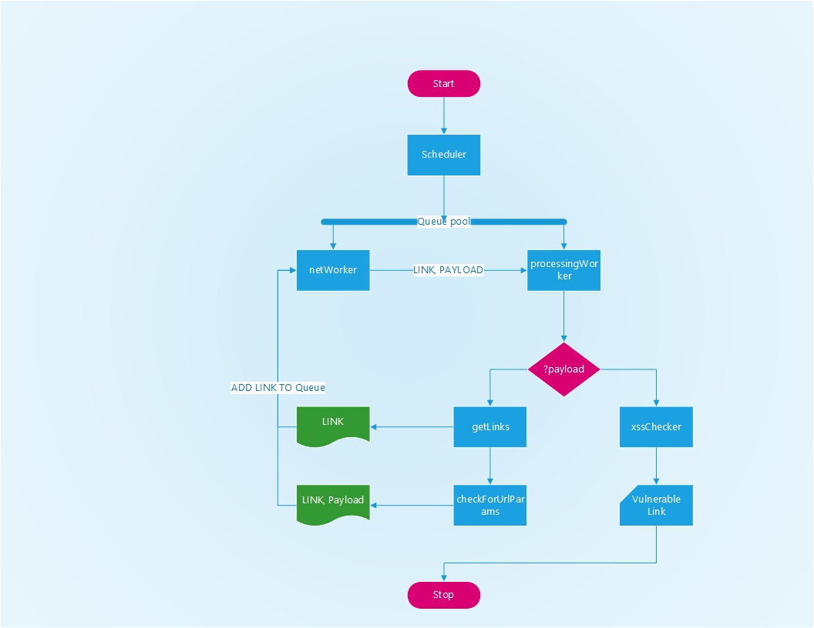

basic-xss-spider
============

This project is fork from https://github.com/DanMcInerney/basic-xss-spider.git

Validate single url
```python basic-xss-spider.py -u https://www.website.com/uk-en/sale/shop-by/view-all-c7774.html```
```python basic-xss-spider.py -u https://www.website.com/uk-en/catalogsearch/result/?q=goods```

Validate entire website
```python basic-xss-spider.py -u https://www.website.com/uk-en/```

Spiders concurrently opening URLs found then checks those URLs for variables. 
If URL variables are found, tests those variables with dangerous XSS characters ```"'><()=;/:```

If it finds all or some important characters in the response HTML it will add the URL to the vulnerable_URLs.txt logfile. 
Uses requests and gevent for async capabilities.

Definitely not without bugs. Rewriting in Scrapy.


